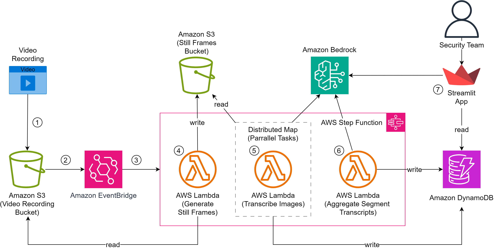
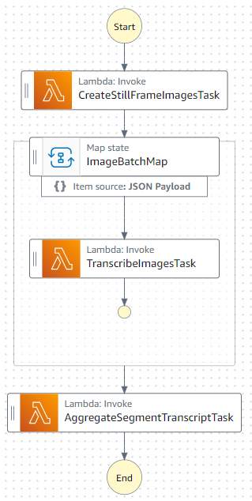

# Video Security Analysis for Privileged Access Management using GenAI

This repository hosts the code for the solution architecture associated with the [Video Security Analysis for Privileged Access Management using GenAI](https://aws.amazon.com/blogs/machine-learning/video-security-analysis-for-privileged-access-management-using-genai/) blog, deployable with the [AWS Cloud Development Kit (AWS CDK)](https://docs.aws.amazon.com/cdk/v2/guide/getting_started.html).

## Solution Architecture Walkthrough
The serverless architecture provides a video processing pipeline and a simple user interface.  This simple architecture can be used for demonstration purposes and testing with your own video recordings and Prompts, it is not suitable for a production use.  See [Limitations](#limitations) for more details.

The serverless architecture uses [Amazon S3](https://aws.amazon.com/s3/), [Amazon Bedrock](https://aws.amazon.com/bedrock/), [AWS Lambda](https://aws.amazon.com/lambda/), [AWS Step Functions](https://aws.amazon.com/step-functions/), [Amazon EventBridge](https://aws.amazon.com/eventbridge/) and [Amazon DynamoDB](https://aws.amazon.com/dynamodb/) to create a pipeline to execute the processing of video recordings into transcripts.  A simple, locally executed, [Streamlit](https://streamlit.io/) application provides the user interface for viewing the transcripts produced by the pipeline and sending the transcripts to Amazon Bedrock to perform Security Analysis.



1. The video processing pipeline is initiated by a user uploading a video recording to an Amazon S3 Bucket, using the [AWS CLI](https://aws.amazon.com/cli/).
1. Once the uploaded is complete, an [S3 Event Notification](https://docs.aws.amazon.com/AmazonS3/latest/userguide/EventNotifications.html) is sent to Amazon EventBridge.
1. An [EventBridge Rule](https://docs.aws.amazon.com/eventbridge/latest/userguide/eb-rules.html) triggers the **video processing pipeline** workflow (State Machine) in AWS Step Functions.  The State Machine consists of 3 Tasks that invoke AWS Lambda Functions.

    

1. **Generate Still Frames Task;** 
    - The Lambda function reads the uploaded video and uses [FFMpeg](https://ffmpeg.org/) to take a still frame image for every second of the video length.
    - The still frame images are then sent to another S3 bucket.
    - A list of the S3 Object Keys is output for the next task.
1. **Transcribe Images Task:** Leveraging a [Distributed Map](https://aws.amazon.com/blogs/aws/step-functions-distributed-map-a-serverless-solution-for-large-scale-parallel-data-processing/) for parallel processing;
    - Each Lambda function retrieves a 20 second segment of the video still frame images from the S3 bucket.
    - The `analysis-prompt` is retrieved from the **LLMPromptTable** table in DynamoDB.
    - The Lambda functions combine the images with the prompt and sends it to Amazon Bedrock.
    - The transcription of the images received back from Amazon Bedrock are then written to the **VideoTranscripts** table in DynamoDB.
    - The transcription of the images received back from Amazon Bedrock are output for the next task.
1. **Aggregate Segment Transcripts;**
    - The `aggregate-prompt` is retrieved from the **LLMPromptTable** table.  
    - The Lambda function combines the segment transcripts with the `aggregate-prompt` and sends it to Amazon Bedrock.
    - The aggregated transcript received back from Amazon Bedrock is then written to the **VideoTranscripts** table in DynamoDB.
1. User Interface (Streamlit App);
    - **View Transcripts:** The Streamlit App accesses the **VideoTranscripts** table in DynamoDB providing the users with a view of the video transcripts. 
    - **Security Analysis:** The Streamlit App accesses the  **LLMPromptTable** table in DynamoDB providing the users with option to send the transcript, with the security analysis prompt to Amazon Bedrock, and view the response.

## Solution Implementation 

### Prerequisites

- An AWS Account. You use must have sufficient permissions to make necessary AWS service calls.
- We recommend deploying to region **us-east-1**.  
    - If you want to use a different region, check [Model support by AWS Region](https://docs.aws.amazon.com/bedrock/latest/userguide/models-regions.html) to select one where Bedrock and the Anthropic Claude 3 Haiku and Sonnet models are available.
- [Model access enabled in Amazon Bedrock](https://docs.aws.amazon.com/bedrock/latest/userguide/model-access.html) for Anthropic Claude 3 Haiku and Sonnet.
- [Git](https://git-scm.com/book/en/v2/Getting-Started-Installing-Git) installed.
- [AWS CLI](https://docs.aws.amazon.com/cli/latest/userguide/getting-started-install.html#getting-started-install-instructions) installed and configured.
- [Python](https://www.python.org/downloads/) 3.12 or above installed.
- [Pixi](https://pixi.sh/latest/#installation) for dependency management installed.
- [wget](https://www.gnu.org/software/wget/) installed (Mac and Linux Only). 
- [md5sha1sum](http://microbrew.org/tools/md5sha1sum/) installed (Mac and Linux Only). 
- [7 Zip](https://www.7-zip.org/download.html) installed (Windows Only).
- Port 8501 opened for Streamlit App.
- An IDE of your choice, such as [VS Code](https://code.visualstudio.com/) installed and configured with your AWS credentials in your terminal.

### Deployment

1. Open the IDE of your choice, and start a new Terminal and configure with your AWS credentials.
    ```
    aws configure
    ```
1. Install the [AWS Cloud Development Kit (AWS CDK) v2 for Python](https://docs.aws.amazon.com/cdk/v2/guide/work-with.html#work-with-library).
    ```
    npm install aws-cdk-lib
    ```
1. Create and activate a Python virtualenv to deploy all dependencies;  
    MacOS and Linux:
    ```
    python -m venv .venv
    source .venv/bin/activate
    ```
    Windows PowerShell:
    ```
    python -m venv .venv
    .venv\Scripts\Activate.ps1
    ```
1. Clone the repository and change into the directory by running the following command in your IDE terminal;
    ```
    git clone https://github.com/aws-samples/genai-video-security-analysis-for-pam.git
    cd genai-video-security-analysis-for-pam
    ```
1. Install the required dependencies;
    ```
    pip install -r requirements.txt
    ```
1. Bootstrap the CDK to prepare your AWS environment for usage with the AWS Cloud Development Kit;
    ```
    cdk bootstrap
    ```
1. Deploy the Solution;
    ```
    cdk deploy
    ```
1. Verify the CDK deployed successfully, and copy the output value for the key **PAMVideoAnalysis.videobucket**. You will use this value to upload video recordings using the AWS CLI.
1. Execute the following commands to setup the Streamlit App for the User Interface.
    ```
    cd ui
    pixi install
    ```

### Test

1. Run the following command to upload the `hello-world.mp4` sample video file to the S3 bucket. Make sure to replace the **\<PAMVideoAnalysis.videobucket>** with the S3 bucket name you copied earlier. 
    ```
    cd ..
    aws s3 cp sample-recordings/hello-world/hello-world.mp4 s3://<PAMVideoAnalysis.videobucket>/hello-world.mp4
    ```
    **Note:** Use the same command to upload your own video recordings, replacing the path and filename.
1. Once the file upload to S3 has completed, the **video processing pipeline** workflow will trigger in AWS Step Functions.  
1. Open the [State machines](https://console.aws.amazon.com/states/home#/statemachines) of the AWS Step Functions console.  
1. Open the **video processing pipeline** State Machine.  Under the **Executions** section, check the **Status** of the latest execution.  Once this reports **Success** move on to the next step.
1. In the Terminal of your IDE, launch the Streamlit app with following command;
    ```
    cd ui
    pixi run start
    ```
1. The output will display two URLs. If the browser does not automatically open, select the link for the Local URL.
1. Under **Select a transcript**, select `hello-world.mp4` from the dropdown menu.
1. Scroll down and view the **Aggregated Transcript**.
    - You may also view the Individual Transcripts and the LLM Prompt used by the **video processing pipeline**.
1. Under the **Security Analysis** section, choose a the **Select Security Analysis Type** you want to execute against the `hello-world.mp4`, from the dropdown.
1. Select the **Perform Security Analysis** button.
1. The Security Analysis response from Amazon Bedrock will be returned and displayed above the Video Player.

    

### Clean up

1. In your IDE of choice, execute the following command in the Terminal.
    ```
    cdk destroy
    ```

## Limitations

The solution architecture has only been designed for demonstration purposes and tested against short length video recordings (<10 minutes).  It is not designed to support production, nor scale to process high volumes of video recordings. 

- **Lambda function timeout:**  Generating still frame images can take a few minutes to complete for Video Recordings that are circa 10MB.  Video Recordings greater than 60MB may exceed the 15 minute Lambda timeout.
- **Image Types:** (At the time of writing) Anthropic Claude only supports jpeg, png, gif and webp image types.
- **Image File Size Limit:** (At the time of writing) The Amazon Bedrock API only supports image file sizes of up to 3.75MB.
- **Image Pixel Size Limit:** (At the time of writing) The Amazon Bedrock API only supports image files with a height and width no more than 8,000 px, and 8,000 px, respectively.

## Security

See [CONTRIBUTING](CONTRIBUTING.md#security-issue-notifications) for more information.

## License

This library is licensed under the MIT-0 License. See the [LICENSE](LICENSE.md) file.

## DISCLAIMER

The solution architecture sample code is provided without any guarantees, and you're not recommended to use it for production-grade workloads. The intention is to provide content to build and learn. Be sure of reading the licensing terms.

This solution architecture sample code depends on software developed at GCC
* http://gcc.gnu.org/
* License: GNU GPL 3+ with GCC Runtime Library

This solution architecture sample code depends on software developed at GCC
* http://gcc.gnu.org/
* License: GPL-3.0-only WITH GCC-exception-3.1

This solution architecture sample code depends on software developed at Anaconda, Inc.
* https://anaconda.org/msys2
* License: GPL-3.0-only WITH GCC-exception-3.1

This solution architecture sample code depends on software developed at Case Western Reserve University
* https://tiswww.case.edu/php/chet/readline/rltop.html
* License: GPL-3.0-only